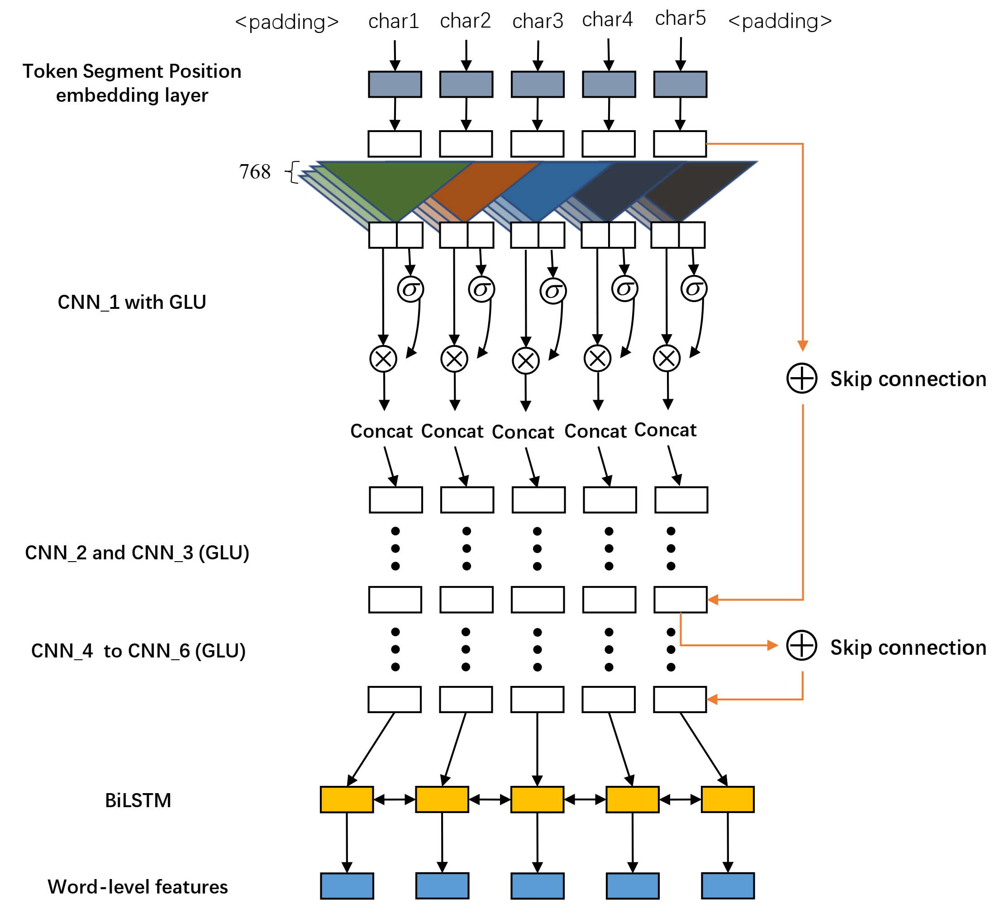
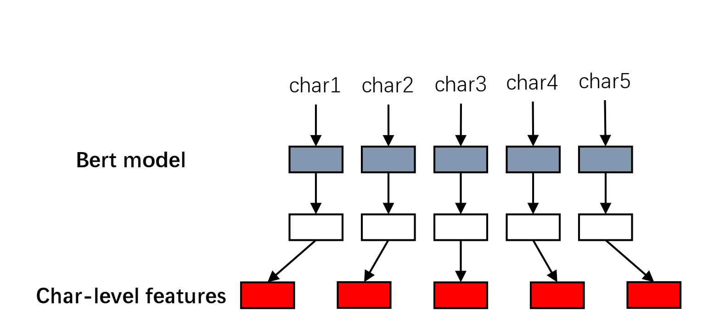

# Chinese-Punctuation-Restoration-with-Bert-CNN-RNN

---

*This repository is developed from a backbone in repo [BertPunc](https://github.com/nkrnrnk/BertPunc). Then, We impleted our original ideas of [Word-level BERT-CNN-RNN Model for Chinese Punctuation Restoration](https://none.cn)*

---

## 1. Difference from My Previous Repo

- previous repo [punctuation-restoration-pytorch](https://github.com/yuboona/punctuation-restoration-pytorch)

Previous work consists a simple BiLSTM network for punctuation restoration. We then tried integrating CNN with the BiLSTM and attention. However, CNN and Attention didn't show any improvement for Chinese Punctation. A seq to seq mechanism also performed baddly on Chinese punctuation restoration task.

**In this work, we bring the bert.But bert has been widly used in many works, for acheive a more meaningful work, we bring the insight of word-level concept in our work.**

**Bert and it's variants rely a character tokenizer of Chinese. Unlike English word tokenizer remaining mostly the word semantic of the english word. Chinese tokenizer just split chinese sentence into characters which don't always represent a complete semantic. It will greatly influnce the model's capability. As you can easily imaging, when a pretrained model  doing a task related fine-tuning, using a character tokenizer will make model concentrating more on the character information. Some word level relation even will be forgot.**

## 2. Methods Details

Our model use two types features for final punctuation predictions:

1. word-level features: Well designed CNN layers. As *Figure 1*.
2. Character level features: Bert outputs. As *Figure 2*.

|*Figure 1. Word-Level features*|
|:-:|
||

|*Figure 2. Character-level features*|
|:-:|
||

## 3. Code

- `train_1_to_1.py` : Training code. (`train.py` is the original train process in BerPunc. It use a bert outputs of 32 neighbor character to predict one character's punctuation.)
- `data_1_to_1.py` : Helper function to read and transform data. (`data.py` the original data helper.)
- **`model_1_to_1.py`** : Consists a lots of our original models. *best model-->* **BertChineseEmbSlimCNNlstmBert**. (`model_1_to_1_seg.py` is a model to integrated a fine-tuned bert model on segmentation task with our model.)
- `evaluate_*.ipynb` : evaluation jupyter notebook on IWSLT Chinese test sets.
- `./data` : Some train and test data.
